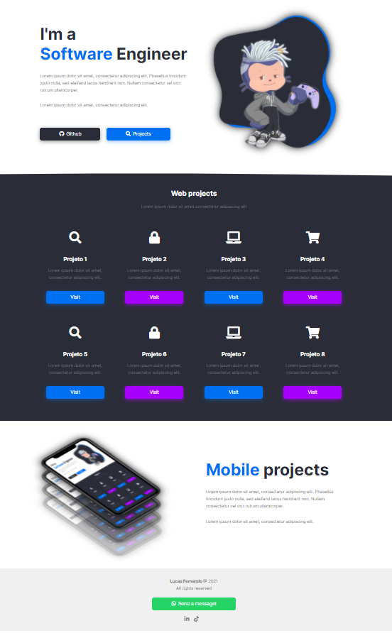

# ~ Web Developer Portfolio ~

Projeto de página de portfolio profissional feita exclusivamente com HTML e CSS. 

  
#### Conceitos aplicados:
- Como criar seu projeto de forma simples;
- Responsividade;
- Flexbox/Grid;
- Animações (internas e externas);
- Variáveis CSS, etc.

#### Ideal para quem:
- Está começando e quer aprender do zero;
- Aprimorar seu conhecimento sem a utilização de libs/frameworks;
- Quer montar uma página própria, etc.

#### Observação:
- Por ser um conteúdo didático, não foram levadas em considerações adaptações para navegadores antigos, como IE.

#### ~ Preview ~ 
\

